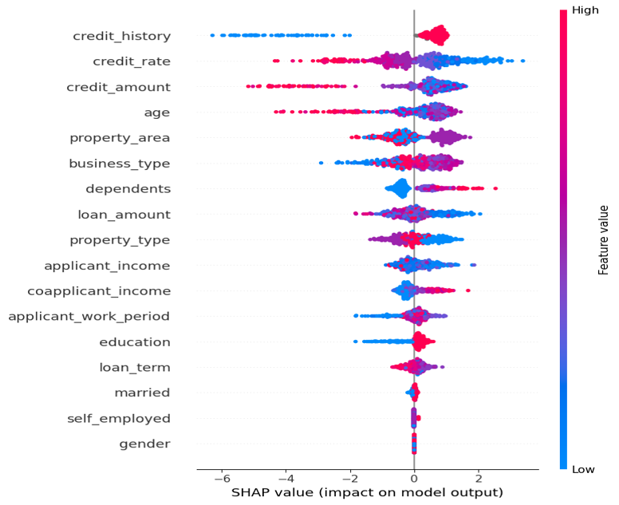
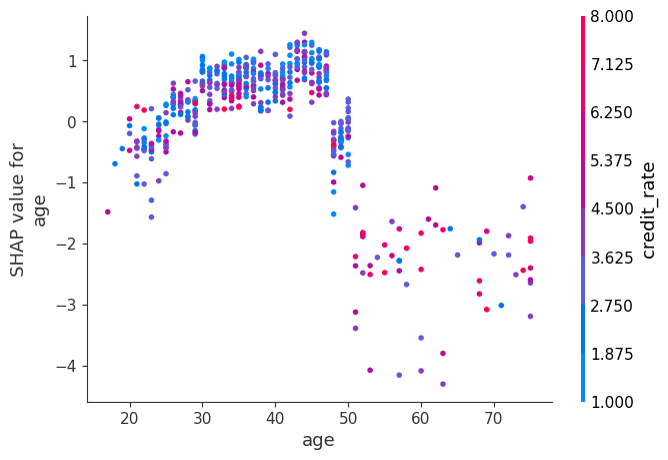

## 🏆 Excellence Award(2nd)
### 2024 Korea National University Statistical Competition

 

## 📌 Problem Statement
Traditional credit loan screening models often achieve reasonable predictive performance,but they suffer from a critical limitation: **lack of interpretability**.  
In real-world financial decision-making, a model must not only predict approval or rejection, but also **clearly explain *why* such a decision was made** in order to ensure trust, fairness, and regulatory compliance.

This project addresses the question:  

  <strong>Which factors does an AI model actually consider important when evaluating credit loan applications?</strong> 

 

## 💡 Proposed Solution

  <!-- Left image -->
  

    

      
    

    

      Global SHAP feature importance for credit loan screening.
    

  

  <!-- Right image -->
  

    

      
    

    

      Local SHAP explanation for an individual loan rejection case.
    

  

We propose an **Explainable AI (xAI)-driven loan screening framework** that combines:
- A high-performance machine learning model for credit approval prediction, and
- Post-hoc explainability techniques to interpret and validate the model’s decisions.

By integrating **SHAP (SHapley Additive exPlanations)** [1] into the pipeline, the system provides both **global feature importance** and **individual-level decision explanations**, enabling transparent and reliable credit screening .
The formal SHAP equation is as follows:

$$
\phi_i = \sum_{S \subseteq N \setminus \{i\}}
\frac{|S|!\,(M-|S|-1)!}{M!}
\Big[
f_{S \cup \{i\}}(x_{S \cup \{i\}})
-
f_S(x_S)
\Big]
$$

where

- **$N$**: the set of all features  
- **$S$**: a subset of features excluding feature $i$  
- **$M$**: the total number of features  
- **$f_S(x_S)$**: the model prediction using only features in $S$  
- **$\phi_i$**: the SHAP value (contribution) of feature $i$  

This formula defines a fair way to **distribute the model output among features**
by averaging each feature’s marginal contribution over all possible feature subsets.

Using SHAP, we can quantitatively explain how much each variable contributes to a
specific prediction.

 

## 🛠️ Technical Overview
- **Dataset**:  
  - 600 samples × 19 financial and demographic features  
  - Features include age, income, credit history, employment status, loan amount, and loan term
- **Model**:  
  - XGBoost classifier for loan approval prediction
- **Explainability**:  
  - SHAP used instead of simple feature importance to capture non-linear feature interactions
  - Global SHAP analysis to identify dominant decision factors
  - Local SHAP analysis to explain individual rejection/approval cases
- **Model Refinement**:  
  - Identified low-impact features via SHAP
  - Removed the bottom 6 least-informative features
- **Deployment**:  
  - Implemented a FastAPI-based inference server
  - Supports new applicant data input and returns:
    - Approval/rejection decision
    - Visual explanation of contributing factors

 

## 🎬 Results and Achievements

  <video controls preload="metadata"
         src="../images/awards/2024-01-27-xAI_Financial/xAI2.mp4"
         poster="../images/awards/2024-01-27-xAI_Financial/xAI.png"
         style="width:80%; max-width:900px; border:1px solid #ddd; border-radius:10px;">
  </video>

- **Model Performance Improvement**:
  - Accuracy before feature removal: **82.11%**
  - Accuracy after SHAP-based feature pruning: **84.55%**
  - **+2.44% absolute accuracy gain**
- **Interpretability Gains**:
  - Clearly identified key drivers of loan decisions (e.g., age, credit history, income stability)
  - Enabled case-level explanations for rejected applicants
- **Practical Impact**:
  - Demonstrated that xAI can be used to design **efficient, transparent, and trustworthy loan screening systems**
  - Showed the feasibility of reducing feature complexity while improving performance
- **Outcome**:
  - Submitted as a financial data analysis competition project
  - Successfully implemented an end-to-end explainable loan screening pipeline

## Commemorative Photo

 

---

## 📚 References
[1] S. Lundberg and S.-I. Lee,  
*A Unified Approach to Interpreting Model Predictions*,  
arXiv:1705.07874, 2017.  
https://arxiv.org/abs/1705.07874
