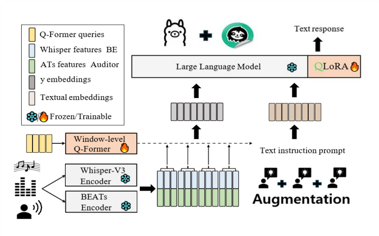
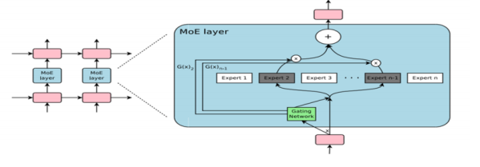
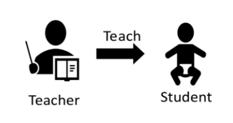
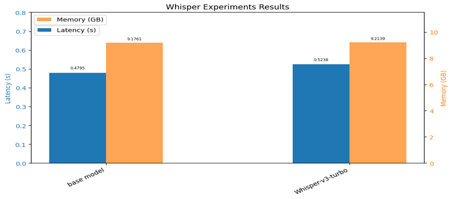
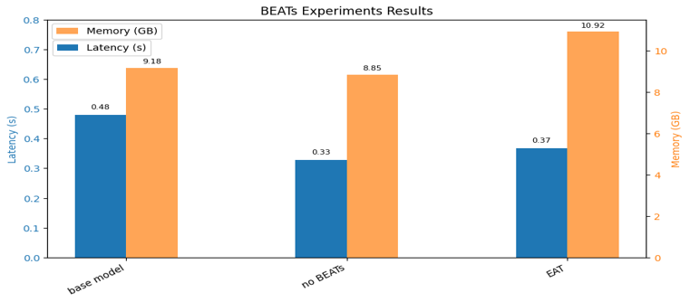
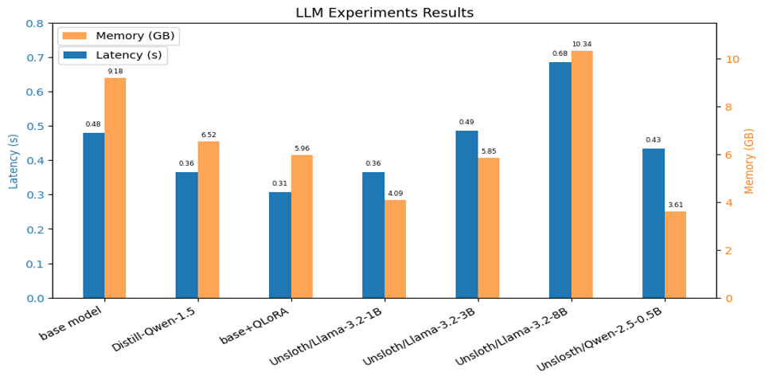
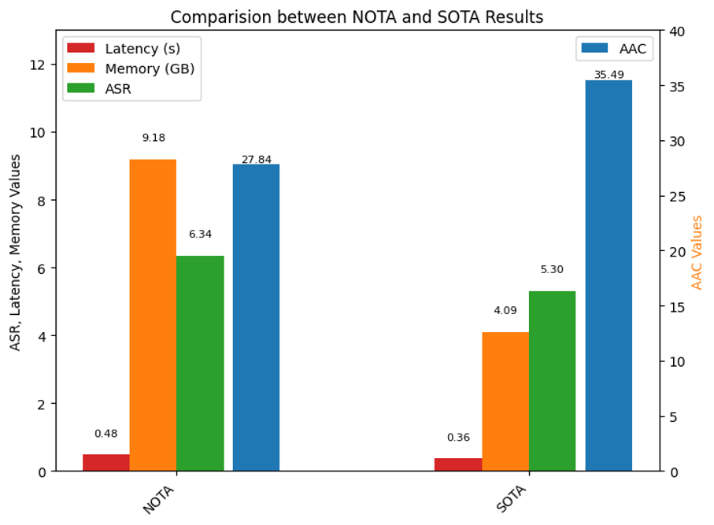

  <b> Overview of the proposed model architecture.</b>

👉 [Code](https://github.com/boostcampaitech7/level4-cv-finalproject-hackathon-cv-16-lv3/tree/main)
 
👉 [Report](../images/projects/Audio_WithNota/Audio_Report.pdf)

## Objective
With the integration and pretraining of audio adapters, large language models have become capable of understanding diverse audio signals—such as speech, music, and environmental sounds—and performing a wide range of downstream tasks. However, in typical device environments with limited VRAM, **lightweight modeling of audio language models is essential**.

The objective of this hackathon is to establish a practical recipe for building **smaller and faster audio language models** that preserve the baseline accuracy on standard audio understanding benchmarks. In particular, we focus on maintaining the performance of the [SALMOON](https://github.com/bytedance/SALMONN?tab=readme-ov-file) model—an audio-centric multimodal LLM capable of processing general audio, speech, and music inputs—while significantly reducing **memory usage** and **inference latency**.

To guide our design choices, we target deployment on mobile GPUs that are suitable for on-device inference, with the following approximate constraints: **ASR latency ≈ 0.05 s, memory usage ≈ 6 GB, time-to-first-token (TTFT) ≈ 1 s, and time-per-output-token (TPOT) ≈ 0.1 s**.
For **audio captioning (AAC)**, since no explicit benchmark threshold is provided, our goal is to avoid noticeable performance degradation while optimizing efficiency.
 

## Method
We adopt SALMONN as the base audio language model and redesign its architecture with a focus on memory efficiency and low-latency inference.
Our approach combines parameter-efficient fine-tuning, sparse activation, and model compression techniques to meet on-device deployment constraints.

The overall architecture of the redesigned model is illustrated below.
<!-- 예시: 동일 높이 220px, 비율 유지 -->

  <figure style="margin:0; text-align:center;">
    
    <figcaption style="margin-top:8px; font-size:0.9em; color:#555;">
      <b>QLoRA</b> 
    </figcaption>
  </figure>

  <figure style="margin:0; text-align:center;">
    
    <figcaption style="margin-top:8px; font-size:0.9em; color:#555;">
      <b>MoE</b>
    </figcaption>
  </figure>

  <figure style="margin:0; text-align:center;">
    
    <figcaption style="margin-top:8px; font-size:0.9em; color:#555;">
      <b>Model Distillation</b>
    </figcaption>
  </figure>

### (1) QLoRA
We apply QLoRA to enable parameter-efficient fine-tuning under limited VRAM.
By fine-tuning low-rank adapters on quantized base weights, we significantly reduce memory usage while preserving the baseline performance of the model.

### (2) MoE
To further improve inference efficiency, we incorporate a Mixture of Experts (MoE) architecture.
During inference, only a small subset of experts is activated for each input, which reduces the number of active parameters and leads to lower latency and memory consumption.

### (3) Distillation
We perform knowledge distillation using DeepSeek-R1 as the teacher model.
This allows the compact student model to retain strong reasoning and audio understanding capabilities while operating with substantially fewer parameters.

### (4) Audio Augmentation
To improve robustness and training stability, we apply simple yet effective audio augmentations, including noise injection and gain control.
These augmentations help the model generalize across diverse audio conditions without increasing computational overhead.

 

## Result
### (1) Encoder & Decoder

  <!-- Left image -->
  

    

      
    

    

      Encoder Experiment
    

  

  <!-- Right image -->
  

    

      
    

    

      Decoder Experiment
    

  

Some models were trained up to Stage 2 but excluded from ASR and AAC evaluation due to limited inference time.
**Whisper-large-v3 turbo** improved ASR by approximately **30%** over Whisper-large-v2 with no significant increase in latency or memory, and was selected as the final encoder.
Removing BEATs reduced latency but severely degraded ASR, while EAT showed abnormal results and was excluded; therefore, **the original BEATs module was retained**.

### (2) LLM & Final Result

  <!-- Left image -->
  

    

      
    

    

      LLM Experiment
    

  

  <!-- Right image -->
  

    

      
    

    

      Final Experiment
    

  

LLM experiments reveal a clear trade-off between latency, memory usage, ASR, and AAC as model size increases.
Applying QLoRA reduces memory usage by nearly 50% while improving ASR by approximately 30%, and the Unsloth-based LLaMA 3.2 1B model achieves the best efficiency when considering both latency and memory. Accordingly, LLaMA 3.2 1B with QLoRA is selected as the final LLM.

 

  <strong>Based on these results, we select Whisper as the audio encoder, BEATs as the audio decoder, and LLaMA 3.2 1B with QLoRA as the final LLM.</strong>

Compared to the 3B lightweight SALMONN model provided by NOTA, the final model is trained using approximately 1.06M Stage 1 samples and 1.15M Stage 2 samples. In a server environment, it achieves <strong>a 16% decrease in ASR, a 27% increase in AAC, a 55% reduction in memory usage, and a 23% reduction in latency</strong>, successfully improving overall efficiency across all metrics.

## Demo 

  

  <b>Demo:</b> Example of the AI model analyzing and responding to audio input based on a given prompt.

