 

## Overview
During the **Naver AI Tech 7th (Computer Vision Track)**, I conducted four major projects ranging from image classification to segmentation. Through this intensive curriculum, I developed expertise in **Data-Centric AI**, **Model Optimization**, and **MLOps tools** (WandB, Poetry).

Below is a summary of the key projects and my specific contributions.

 

---
### 1. Sketch Image Classification (ImageNet-Sketch) 
👉 [Code](https://github.com/2JAE22/level1-imageclassification-cv-02)

  

    

      
    

    

      SketchDataSet_Example1
    

  

  

    

      
    

    

      SketchDataSet_Example2
    

  

**Objective** Build a robust baseline image classification model on the ImageNet-Sketch dataset, focusing on improving generalization performance through data-centric strategies.

 

🎯 **My Role**:
- Led **dataset analysis and data-centric optimization**, identifying performance bottlenecks caused by dataset structure rather than model capacity
- Designed and validated **data cleaning policies** for duplicate and ambiguous samples
- Implemented and evaluated **augmentation and preprocessing strategies** tailored to sketch-style images
- Managed experiments and hyperparameter searches using **Weights & Biases**

 

**Approach & Key Solutions**

🛠️ **Methods**:

- **Exploratory Data Analysis (EDA)**
  - Analyzed image count per class and class imbalance
  - Identified near-duplicate sketches caused by flips and rotations
  - Examined object placement and background patterns to guide preprocessing decisions

- **Data Cleaning**
  - Removed near-duplicate samples dominating certain classes
  - Pruned ambiguous samples between visually overlapping classes (e.g., baseball icon vs. baseball player)
  - Verified that simple removal outperformed synthetic data generation approaches

- **Targeted Augmentation (Albumentations)**
  - Avoided Flip/Rotate-heavy augmentations already present in the dataset
  - Applied controlled **ShiftScaleRotate (wrap mode)** to improve spatial robustness
  - Used **GaussianBlur** to reduce overfitting to repeated line patterns
  - Empirically confirmed that aggressive augmentations (e.g., CoarseDropout, GridShuffle) degraded performance

- **Grayscale-aware Preprocessing**
  - Identified that ImageNet-Sketch images are inherently grayscale
  - Compared:
    1. Replicating grayscale to 3-channel input
    2. Modifying pretrained Conv2D weights for single-channel input
  - Computed dataset-specific mean and standard deviation for grayscale normalization

- **Experiment Management**
  - Tracked experiments and metrics using **WandB**
  - Performed hyperparameter optimization via **WandB Sweeps**
  - Compared CNN-based and ViT-based models from an inductive bias perspective 

 

📊 **Result**:

- Achieved up to **~0.92 classification accuracy**, outperforming naive augmentation baselines
- Demonstrated that **dataset de-duplication and ambiguity removal** provided larger gains than architectural changes
- Confirmed that indiscriminate augmentation **degrades performance** on already-distorted sketch data

 

**Key Insight** For sketch-based image classification, **data quality and class clarity matter more than model complexity**.
Removing misleading samples consistently improved generalization, while indiscriminate augmentation led to performance collapse.

---

### 2. Trash Object Detection
👉 [Code](https://github.com/2JAE22/objectdetection-cv-02)
👉 [Report](../images/projects/Naver_boostcamp/TrashDetection_WrapupReport.pdf)

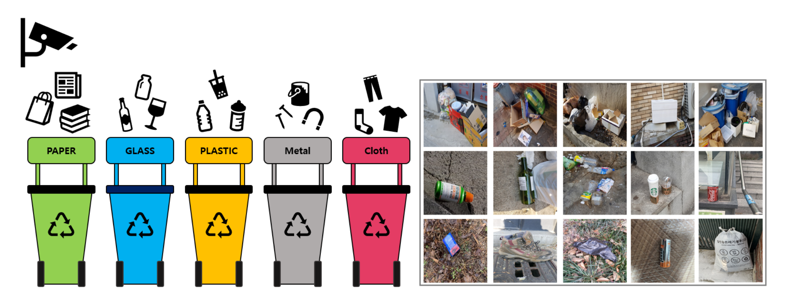

**Objective**: Detect and classify trash in high-resolution (1024x1024) images into 10 categories.
* 🔍 **EDA**: ① Box ② Class ③ Color
<!-- 🔍 EDA Visualization (3x3 Grid) -->

  <!-- 1 -->
  

    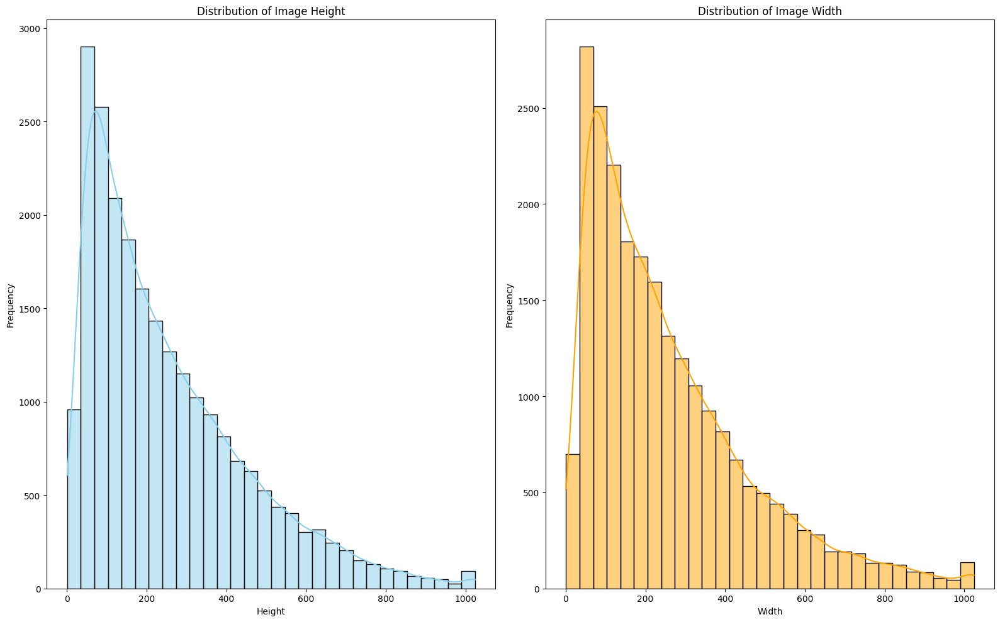
  

  <!-- 2 -->
  

    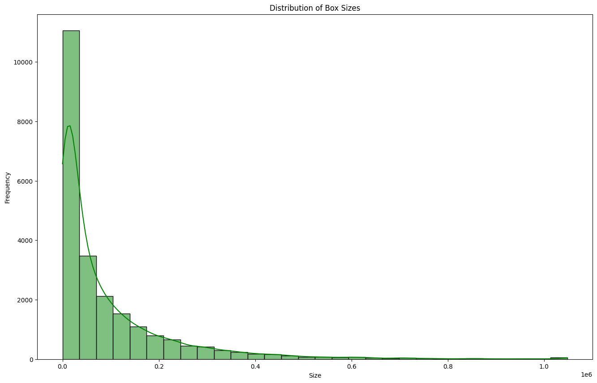
  

  <!-- 3 -->
  

    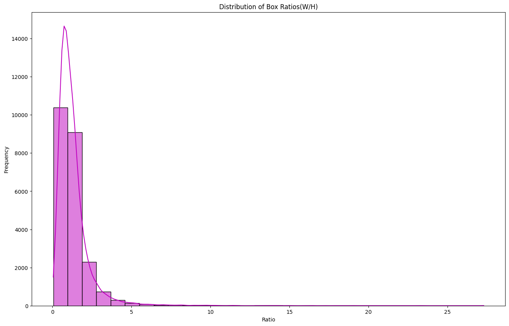
  

  <!-- 4 -->
  

    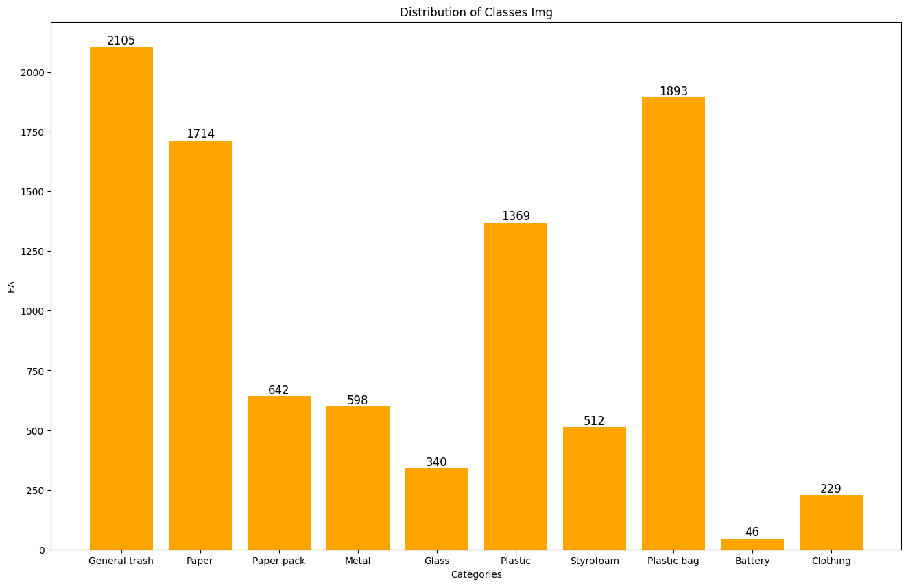
  

  <!-- 5 -->
  

    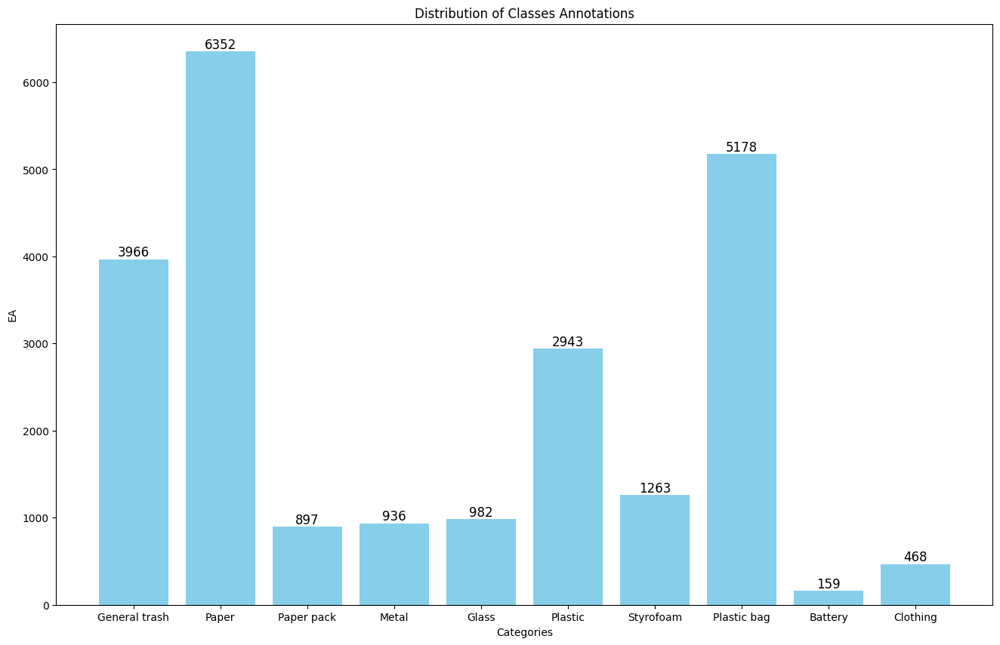
  

  <!-- 6 -->
  

    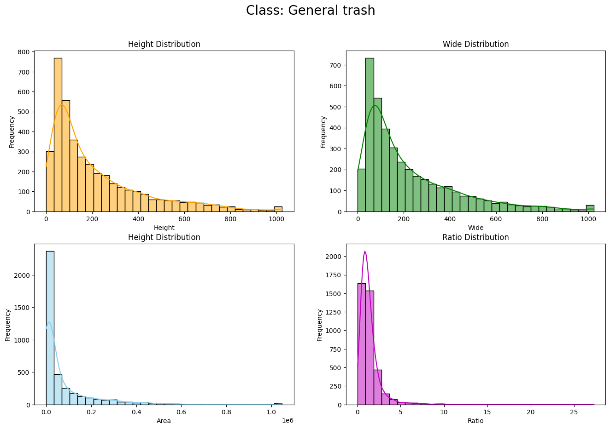
  

  <!-- 7 -->
  

    
  

  <!-- 8 -->
  

    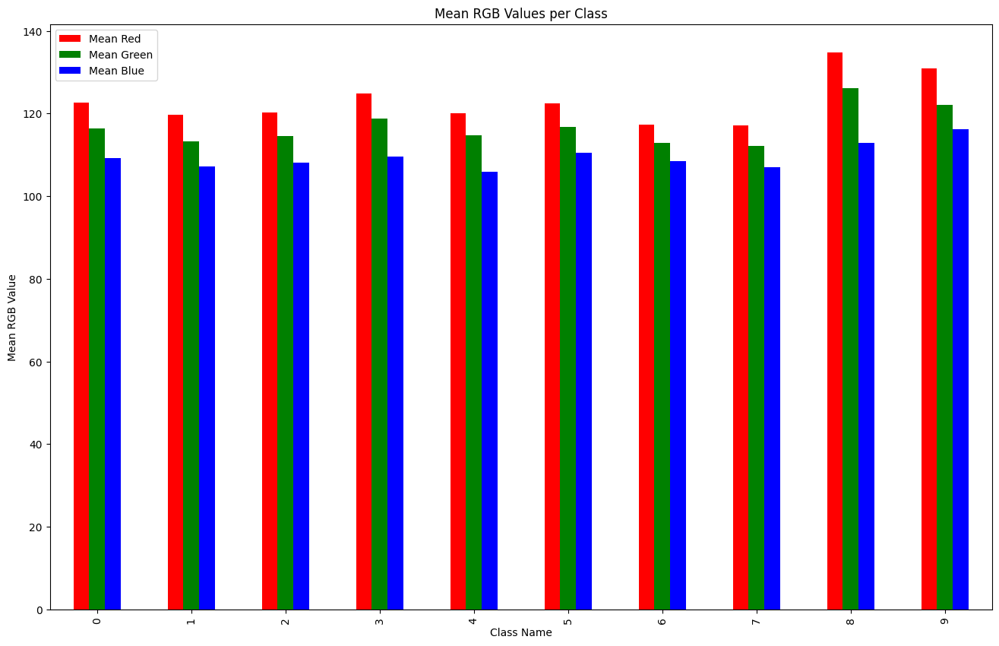
  

  <!-- 9 -->
  

    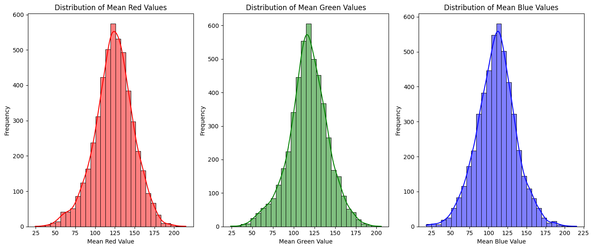
  

* 🎯 **My Role**:
    * **YOLO Implementation**: Experimented with **YOLOv11 (s, l, xl)** models to verify the performance of 1-stage detectors compared to 2-stage models.
    * **Ensemble Strategy**: Contributed to the final ensemble by combining YOLO predictions with the team's Cascade R-CNN and DINO models.
* 🛠️ **Methods**:
    * **Augmentation**: Applied Mosaic, MixUp, and RandomCrop to handle object scale variations.
    * **Ensemble**: Used **WBF (Weighted Boxes Fusion)** and Soft-NMS to merge bounding boxes effectively.
* 📊 **Result**: Achieved Public Score **0.6714** / Private Score **0.6558**.
 
You can find the detailed experimental results below.
<iframe
  src="https://wandb.ai/leejken530-kyungpook-national-university/recycling/reports/curves/Recall-Confidence(B)?embed=true"
  width="100%"
  height="600"
  frameborder="0"
></iframe>

  <!-- 1 -->
  

    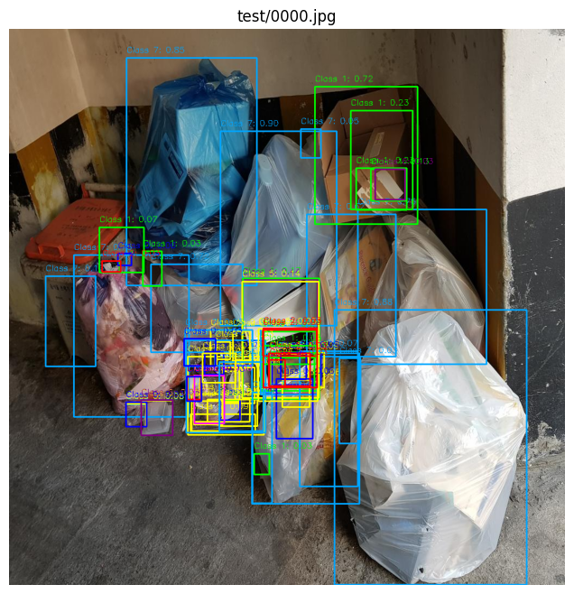
  

  <!-- 2 -->
  

    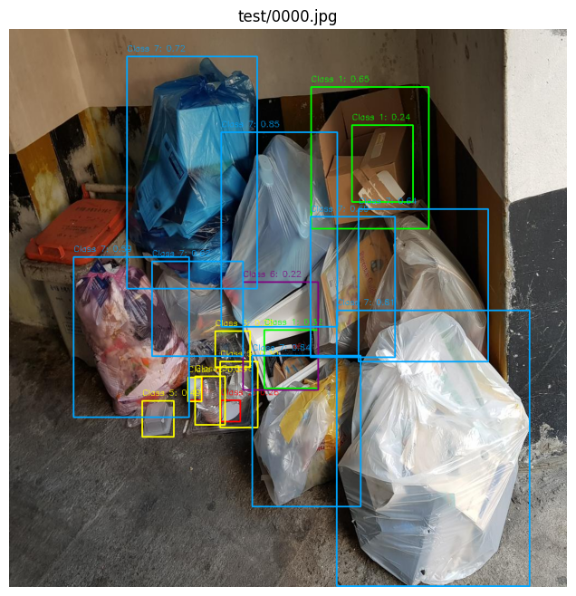
  

  <!-- 3 -->
  

    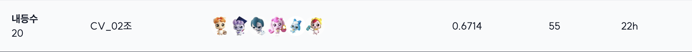
  

  <!-- 4 -->
  

    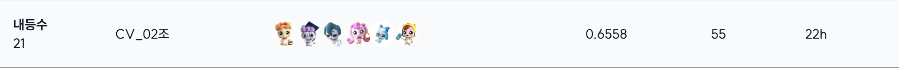
  

 

* **Summary**
> **Conducted large-scale object detection experiments using YOLOv11 and multi-model ensembles (Cascade R-CNN, DINO), achieving Public 0.6714 / Private 0.6558 through optimized augmentation and bounding-box fusion strategies.**

---

### 3. Data-Centric: Multilingual Receipt OCR
👉 [Code](https://github.com/2JAE22/datacentric-cv-02)
👉 [Report](../images/projects/Naver_boostcamp/DataCentricOCR_WrapupReport.pdf)

  <!-- Left image -->
  

    

      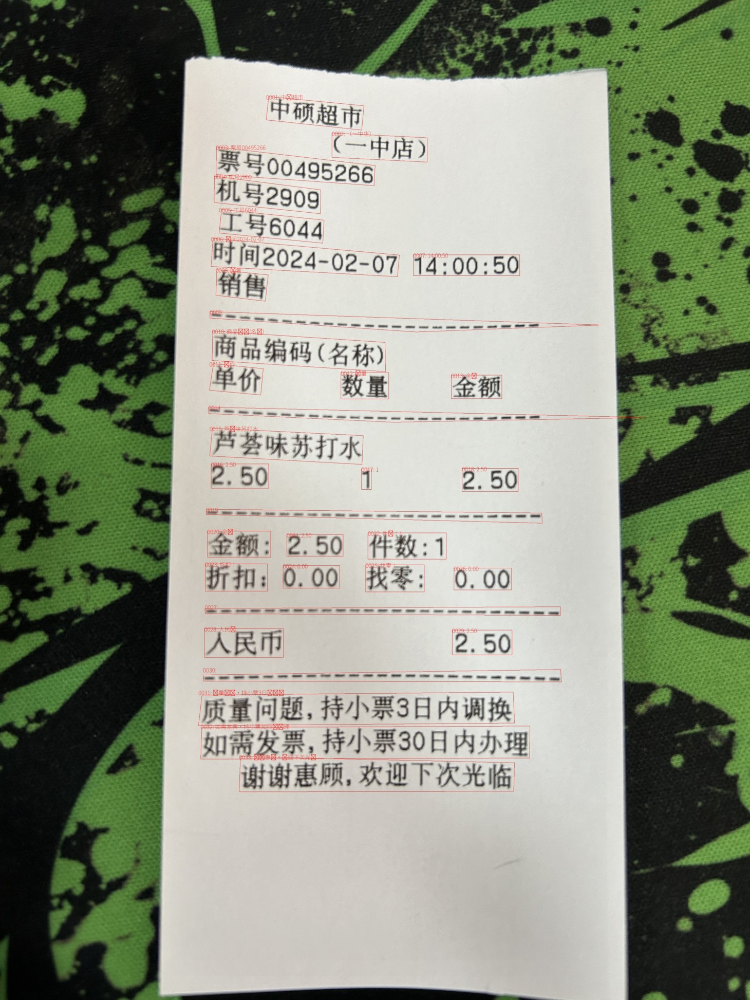
    

    

      OCR_Example1
    

  

  <!-- Right image -->
  

    

      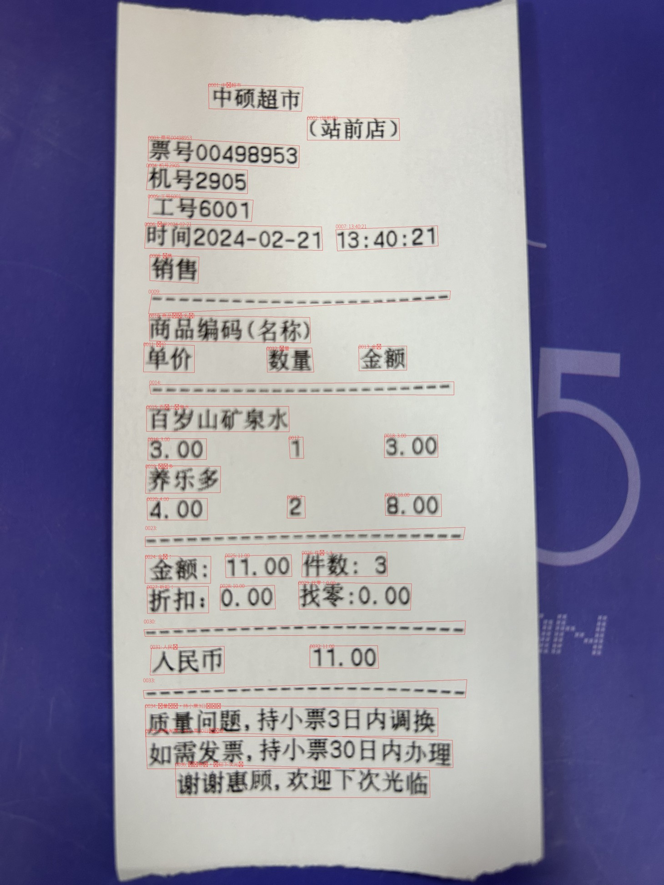
    

    

      OCR Example2
    

  

**Objective**: Improve OCR performance for multilingual receipts (Chinese, Japanese, Thai, Vietnamese) purely through **Data Preprocessing** (Model architecture fixed).
* **Metrics**: DetEval (F1 Score)
* **🎯 My Role**:
    * **Data Labeling & Cleaning**: Manually corrected orientation issues and removed noise from the Ground Truth labels to improve data quality.
    * **Visualization**: Developed a **Streamlit** dashboard to visualize data distribution and augmentation effects for the team.
* **🛠️ Methods**:
    * **Dataset Expansion**: Integrated external datasets (ICDAR, CORD).
    * **Augmentation**: Applied Perspective Transform and various noise injections (Gaussian, Salt & Pepper).
* **📊 Result**: Achieved **F1 Score 0.8100** (Public) / 0.8078 (Private).

* **Performance Comparison (Before vs. After Ensemble)**

| Stage      | Model / Setting          | Epoch | Precision | Recall    | F1 Score                                   | Key Configuration                                                    |
| ---------- | ------------------------ | ----- | --------- | --------- | ------------------------------------------ | -------------------------------------------------------------------- |
| **Before** | Version 1                | 150   | –         | –         | –                                          | translate (50%), salt & pepper (50%), add line (50%)                 |
|            | Version 2                | 150   | 0.7734    | 0.7032    | 0.7366                                     | translate (50%), gaussian (50%), add line (50%)                      |
|            | Version 3                | 150   | 0.5503    | 0.5088    | 0.5288                                     | translate (50%), salt & pepper (35%), gaussian (35%), add line (50%) |
|            | Version 4                | 150   | 0.6855    | 0.6681    | 0.6767                                     | rotate 90°                                                           |
| **After**  | **Final Ensemble Model** | –     | **0.81+** | **0.80+** | **0.8100 (Public)** / **0.8078 (Private)** | Hard Voting Ensemble (Optimized IoU & Vote Thresholds)               |

* **Summary**

> **After applying an optimized ensemble strategy, the F1 score improved from a maximum of 0.7366 (single model) to 0.8100 (Public) and 0.8078 (Private), demonstrating a balanced improvement in both precision and recall.**

 

---

### 4. Bone Segmentation
👉 [Code](https://github.com/2JAE22/semanticsegmentation-cv-16-lv3)
👉 [Report](../images/projects/Naver_boostcamp/HandBone_Image Segmentation_WrapupReport.pdf)

  
  

    This Streamlit app was developed to provide detailed, step-by-step visualization of hand bone segmentation examples.
  

**Objective**: Develop a segmentation model to precisely identify bone areas in medical X-ray images.
* **Metrics**: Dice Score
* **🎯 My Role & Technical Approach**:
    * **Library Comparison & Data Workflow**: Conducted analysis of folder structures and performed detailed data EDA, then refactored the pipeline for efficient data preprocessing and augmentation using various libraries.
    * **Encoder Experiments**: Analyzed performance differences between Transformer-based encoders and CNN-based encoders.
    * **Troubleshooting**: Resolved weight initialization errors (`encoder_weights: None`) and decoder compatibility issues.
* **🛠️ Methods**:
    * **Model Architecture**: Found that **U-Net** provided more stable performance on medical data compared to DeepLabV3+ or U-Net++.
    * **Hyperparameter Tuning**: Optimized Image Size and Epochs using WandB Sweeps.

* **📊 Result**:
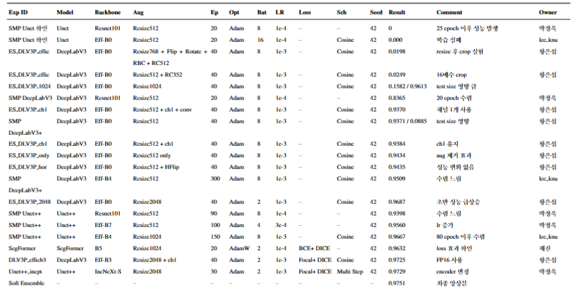

Finally, the best result was obtained <strong>by combining high-resolution inputs with attention-enhanced decoding and a soft ensemble strategy</strong>, achieving a <strong>Dice score of 0.9751</strong> on the test set.

### 📸 Commemorative Photos

  <figure style="text-align:center;">
    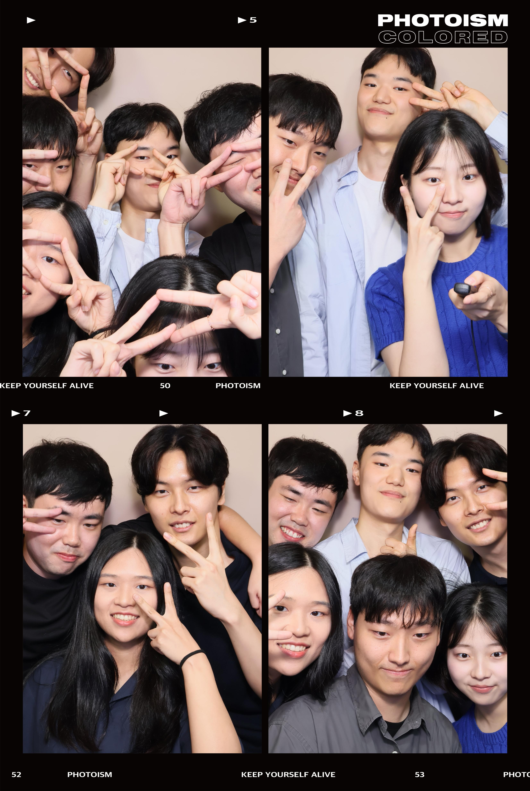
    <figcaption style="margin-top:8px; font-size:0.9rem; color:#555;">
      First Team Commemorative Photo
    </figcaption>
  </figure>

  <figure style="text-align:center;">
    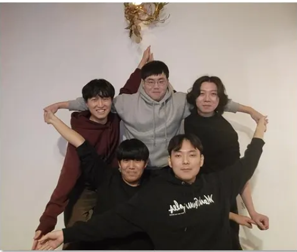
    <figcaption style="margin-top:8px; font-size:0.9rem; color:#555;">
      Second Team Commemorative Photo
    </figcaption>
  </figure>

