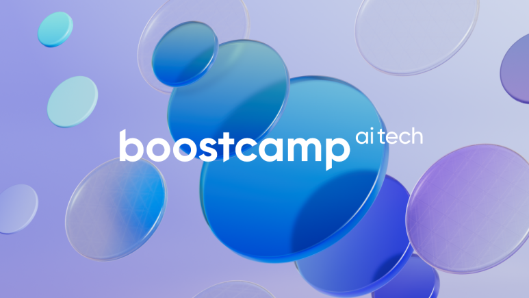
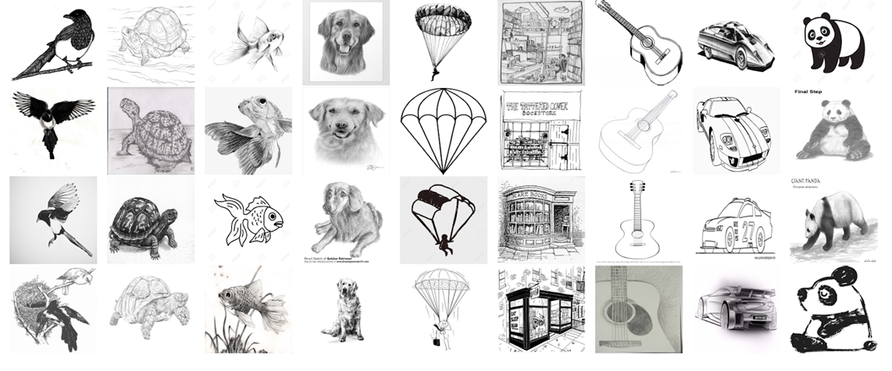
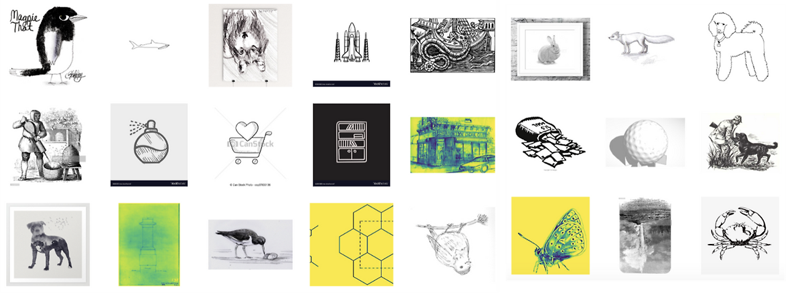
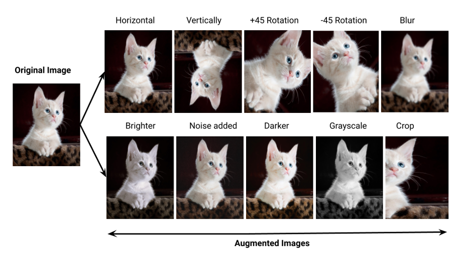
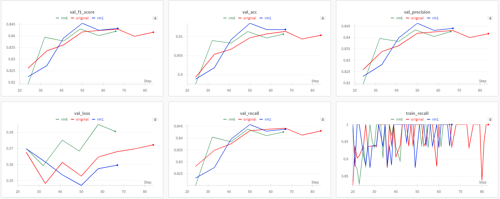

 

## Overview
During the **Naver AI Tech 7th (Computer Vision Track)**, I conducted four major projects ranging from image classification to segmentation. Through this intensive curriculum, I developed expertise in **Data-Centric AI**, **Model Optimization**, and **MLOps tools** (WandB, Poetry).

Below is a summary of the key projects and my specific contributions.

 

---

### 1. Sketch Image Classification (ImageNet-Sketch) · 🔗 [GitHub](https://github.com/2JAE22/level1-imageclassification-cv-02)

  <!-- Left image -->
  

    

      
    

    

      SketchDataSet_Example1
    

  

  <!-- Right image -->
  

    

      
    

    

      SketchDataSet_Example2
    

  

**Objective**  
Build a robust baseline image classification model on the ImageNet-Sketch dataset,focusing on improving generalization performance through data-centric strategies.

**Problem Definition**  
Initial experiments revealed that model performance was not limited by architecture,
but by dataset quality and structure:
- Many samples were near-duplicates (flips, rotations), inflating dataset size without increasing diversity
- Some classes contained extremely few unique images, causing severe overfitting
- Ambiguous class boundaries (e.g., baseball icon vs. baseball player) introduced label noise
- Naive augmentation strategies (e.g., RandAugment) degraded performance due to existing distortions in the dataset

**Approach & Key Solutions**

- **Exploratory Data Analysis (EDA)**  
  Conducted dataset-wide analysis on:
  - Image count per class
  - Duplicate patterns and repeated sketches
  - Object placement and background characteristics  
  This analysis guided all subsequent data cleaning and augmentation decisions.

- **Data Cleaning (Duplicate & Ambiguous Sample Removal)**  
  - Removed near-duplicate images in classes dominated by a single sketch pattern
  - Pruned ambiguous samples between visually overlapping classes (e.g., baseball-related categories)
  - Verified that simple removal outperformed synthetic data generation via image-to-image translation

- **Targeted Augmentation Design (Albumentations)**  
  Designed augmentation strategies aligned with dataset characteristics:
  - Avoided Flip/Rotate-heavy augmentations already present in the data
  - Applied controlled **ShiftScaleRotate (wrap mode)** to improve spatial robustness
  - Used **GaussianBlur** to reduce overfitting on repeated line patterns
  - Verified that aggressive methods (RandomGridShuffle, CoarseDropout) harmed performance

- **Grayscale-aware Preprocessing**  
  - Identified that ImageNet-Sketch images are inherently grayscale
  - Evaluated two strategies:
    1) Replicating grayscale to 3-channel input (baseline)
    2) Converting pretrained Conv2D weights to accept single-channel input  
  - Computed dataset-specific mean/std statistics for grayscale normalization

- **Experiment Management & Optimization**  
  - Used **Weights & Biases (WandB)** for systematic experiment tracking
  - Performed hyperparameter tuning via **WandB Sweeps**
  - Compared ViT-based (EVA-CLIP) and CNN-based models from an inductive bias perspective

**Results**  

- Achieved up to **~0.92 accuracy**, outperforming naive augmentation baselines
- Demonstrated that **dataset de-duplication and ambiguity removal** yielded larger gains than architectural changes
- Confirmed that overly aggressive augmentations degrade performance on already-distorted sketch data

**Key Insight**  
For sketch-based image classification, **data quality and class clarity matter more than model complexity**.
Removing misleading samples consistently improved generalization, while indiscriminate augmentation led to performance collapse.

 

---

### 2. Trash Object Detection
**Objective**: Detect and classify trash in high-resolution (1024x1024) images into 10 categories.
* **Metrics**: mAP50
* **My Role**:
    * **YOLO Implementation**: Experimented with **YOLOv11 (s, l, xl)** models to verify the performance of 1-stage detectors compared to 2-stage models.
    * **Ensemble Strategy**: Contributed to the final ensemble by combining YOLO predictions with the team's Cascade R-CNN and DINO models.
* **Methods**:
    * **Augmentation**: Applied Mosaic, MixUp, and RandomCrop to handle object scale variations.
    * **Ensemble**: Used **WBF (Weighted Boxes Fusion)** and Soft-NMS to merge bounding boxes effectively.
* **Result**: Achieved Public Score **0.6714** / Private Score **0.6558**.

 

---

### 3. Data-Centric: Multilingual Receipt OCR
**Objective**: Improve OCR performance for multilingual receipts (Chinese, Japanese, Thai, Vietnamese) purely through **Data Preprocessing** (Model architecture fixed).
* **Metrics**: DetEval (F1 Score)
* **My Role**:
    * **Data Labeling & Cleaning**: Manually corrected orientation issues and removed noise from the Ground Truth labels to improve data quality.
    * **Visualization**: Developed a **Streamlit** dashboard to visualize data distribution and augmentation effects for the team.
* **Methods**:
    * **Dataset Expansion**: Integrated external datasets (ICDAR, CORD).
    * **Augmentation**: Applied Perspective Transform and various noise injections (Gaussian, Salt & Pepper).
* **Result**: Achieved **F1 Score 0.8100** (Public) / 0.8078 (Private).

 

---

### 4. Bone Segmentation
**Objective**: Develop a segmentation model to precisely identify bone areas in medical X-ray images.
* **Metrics**: Dice Score
* **My Role & Technical Approach**:
    * **Library Comparison**: Conducted comparative experiments between `torchseg` and `smp` libraries.
    * **Encoder Experiments**: Analyzed performance differences between Transformer-based encoders and CNN-based encoders.
    * **Troubleshooting**: Resolved weight initialization errors (`encoder_weights: None`) and decoder compatibility issues.
* **Methods**:
    * **Model Architecture**: Found that **U-Net** provided more stable performance on medical data compared to DeepLabV3+ or U-Net++.
    * **Hyperparameter Tuning**: Optimized Image Size and Epochs using WandB Sweeps.