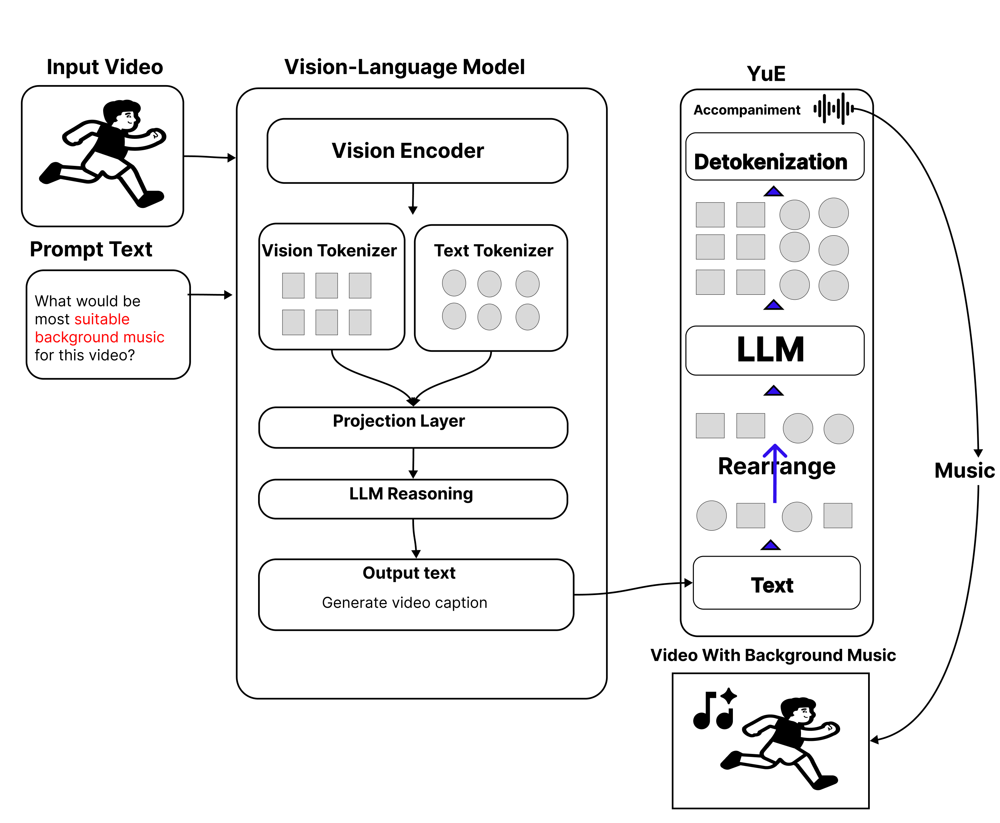

👉 [Paper](../paper/ASK_2025_Video-to-Music/PDF_ASK_Video-to-Music.pdf)
 
👉 [Project Page](https://2jae22.github.io/projects/CV/Video-to-BackgroundMusic/)

## Abstract

This project presents an end-to-end framework for <strong>automatically understanding video content and generating aligned multimedia outputs</strong>. 
The proposed system analyzes visual semantics from input videos and produces structured representations that enable downstream generation and evaluation.
Our approach demonstrates robust performance across diverse video scenarios, highlighting its applicability to real-world multimedia pipelines.

 

## Introduction

With the rapid growth of multimedia content, automated understanding and generation of video-related information have become increasingly important.
Recent advances in vision-language models have enabled more accurate semantic interpretation of visual data.
In this project, we focus on designing a unified pipeline that connects video understanding with generation-oriented objectives, emphasizing scalability and qualitative consistency.

 

## Method

Our method consists of a structured pipeline that processes input videos and transforms them into semantically meaningful representations.
The overall architecture is designed to be modular, allowing each component to be independently improved or replaced.

<!-- Method image placeholder -->

  
  

    Figure. Overall architecture of the proposed framework.
  

 

### Result

We evaluate our approach through qualitative results that demonstrate the effectiveness of the proposed framework.
The following examples illustrate representative outputs under different conditions.

  <!-- Column headers -->
  

    
Before

    
After

  

  <!-- Video grid -->
  

    <!-- Row 1 -->
    <video controls preload="metadata" style="width:100%; border-radius:8px;">
      <source src="../images/projects/V2M/video1.mp4" type="video/mp4">
    </video>

    <video controls preload="metadata" style="width:100%; border-radius:8px;">
      <source src="../images/projects/V2M/video2.mp4" type="video/mp4">
    </video>

    <!-- Row 2 -->
    <video controls preload="metadata" style="width:100%; border-radius:8px;">
      <source src="../images/projects/V2M/video3.mp4" type="video/mp4">
    </video>

    <video controls preload="metadata" style="width:100%; border-radius:8px;">
      <source src="../images/projects/V2M/video4.mp4" type="video/mp4">
    </video>

  

